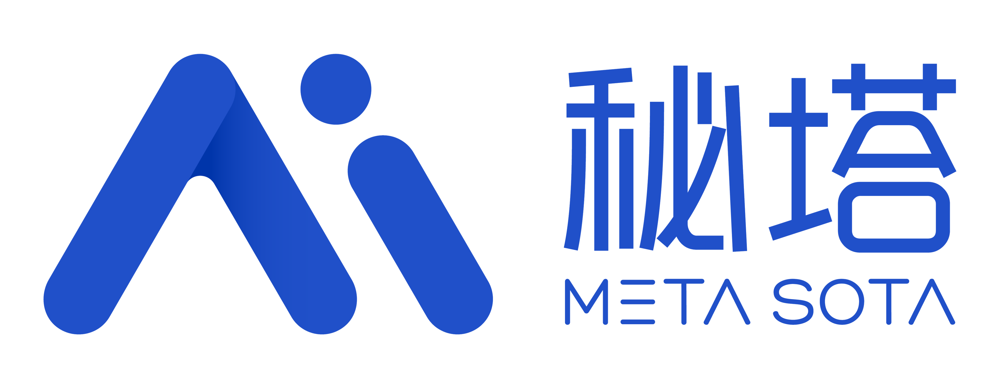
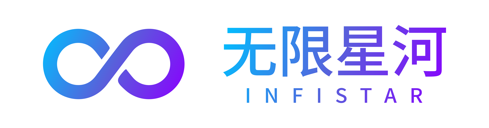

<p align="center">
  
</p>

<h1 align="center">无限画布 (infinite-canvas)</h1>

<p align="center">
  <a href="https://linux.do/"></a>
  <a href="https://render.com/deploy?repo=https://github.com/basketikun/infinite-canvas"></a>
  <a href="https://github.com/basketikun/infinite-canvas"></a>
  <a href="https://github.com/basketikun/infinite-canvas/tags"></a>
  <a href="LICENSE"></a>
  <a href="https://vite.dev/"></a>
  <a href="https://reactrouter.com/"></a>
</p>

<p align="center">
<a href="https://trendshift.io/repositories/50077?utm_source=repository-badge&amp;utm_medium=badge&amp;utm_campaign=badge-repository-50077" target="_blank" rel="noopener noreferrer"></a>
</p>

<p align="center">
  <a href="docs/content/docs/overview/quick-start.mdx">快速开始</a> · <a href="docs/content/docs/overview/features.mdx">功能介绍</a> · <a href="docs/content/docs/overview/render.mdx">Render 部署</a> · <a href="docs/content/docs/overview/docker.mdx">Docker 部署</a> · <a href="docs/content/docs/canvas/canvas-node-manual.mdx">画布节点操作手册</a> · <a href="docs/content/docs/canvas/canvas-shortcuts.mdx">画布快捷键</a> · <a href="SECURITY.md">漏洞提交</a> · <a href="docs/content/docs/progress/todo.mdx">待办事项</a> · <a href="canvas-agent/README.md">本地 Canvas Agent</a> · <a href="plugins/infinite-canvas">Codex app 插件</a>
</p>

无限画布是一款在浏览器中运行的开源多模态创作工作台。它把提示词、参考素材、模型配置和生成结果组织成可连接的画布节点，适合连续完成图片、文本、视频和音频内容的探索与迭代。

## 项目解决了什么问题

使用多个 AI 模型创作时，提示词、参考图、参数和输出通常分散在不同页面或聊天记录中，结果之间的关系也很难保留。无限画布提供一个以节点和连线为中心的工作空间：

- 把文本、图片、视频、音频和生成配置放在同一张画布上，保留输入与结果的上下游关系。
- 通过多个模型渠道统一管理 Base URL、API Key、模型列表和默认模型，减少在不同服务之间反复切换配置。
- 让参考图、上游文本和素材可以重复组合，生成结果可以继续成为下一次生成的输入。
- 将常用提示词、图片素材、画布项目和生成记录保存在浏览器本地，并可按需使用 WebDAV 同步。
- 可选连接本地 Canvas Agent，让 Codex 或 Claude Code 在用户确认后读取和修改当前画布。

## 主要功能

| 能力 | 当前实现 |
| --- | --- |
| 无限画布 | 多画布项目；图片、文本、生成配置、视频、音频和分组节点；拖拽、缩放、框选、连线、小地图、撤销重做、复制粘贴和项目 JSON 导入导出。 |
| 多模态生成 | 浏览器直接请求用户配置的模型服务，支持图片生成与编辑、文本生成、视频生成和音频生成；具体可用能力取决于所选模型和接口。 |
| 多渠道配置 | 支持多个 OpenAI 兼容或 Gemini 格式渠道，为模型标注图片、视频、文本或音频能力，并分别选择四类默认模型。 |
| 图片工作流 | 上传或拖入图片、参考图编辑、裁剪、本地多角度变换、失败重试、多图结果展开与主图切换、下载及保存到素材库。 |
| 上下游引用 | 生成配置节点可组合连接的文本、图片、视频和音频；编辑器支持 `@` 引用已连接资源。 |
| 画布助手 | 围绕选中节点及其上游内容进行文本问答或图片生成，并可把回答和图片插回画布。 |
| 提示词与素材 | 内置 7 个提示词来源，支持搜索、筛选、自定义标准 JSON 来源和本地缓存；素材库支持文本、图片、标签、搜索和插入画布。 |
| 配置与同步 | 支持配置 JSON 导入导出、本地存储占用查看、可选本地代理，以及画布、素材和生成记录的 WebDAV 同步。 |
| 扩展能力 | 支持通过 URL 安装节点插件，并提供 TypeScript 插件 SDK；可选使用本地 Canvas Agent 和 Codex App 插件操作画布。 |

完整能力和当前限制见[功能介绍](docs/content/docs/overview/features.zh-CN.mdx)。

## 安装方法

### 方式一：本地开发

需要安装 Git 和 Bun。项目的前端应用位于 `web/`：

```bash
git clone https://github.com/basketikun/infinite-canvas.git
cd infinite-canvas/web
bun install
bun run dev
```

启动后访问：

```text
http://localhost:3000
```

构建静态产物：

```bash
cd web
bun run build
```

构建结果位于 `web/dist/`。

### 方式二：Docker

直接运行发布镜像：

```bash
git clone https://github.com/basketikun/infinite-canvas.git
cd infinite-canvas
docker compose up -d
```

基于当前源码构建并运行：

```bash
docker compose -f docker-compose.local.yml up -d --build
```

两种方式均默认监听 `http://localhost:3000`。主应用镜像只提供静态前端，AI 请求仍由浏览器直接发送到用户配置的接口。

### 方式三：Vercel

在 Vercel 中导入本仓库即可。根目录的 `vercel.json` 会在 `web/` 中安装依赖、执行 Vite 构建，并把 `web/dist/` 作为单页应用发布。

### Windows 桌面开发入口（可选）

仓库包含一个 WPF 启动器，可启动当前 `web/` 目录的 Vite 服务并以 Edge App 模式打开画布。它目前用于 Windows 本地开发和验收，不是正式安装器。使用前先安装 `web/` 依赖，再在项目根目录的 PowerShell 中运行：

```powershell
.\desktop\publish.ps1
```

当前桌面入口仍依赖 Microsoft Edge，并按现有开发运行方式使用 Node.js 启动 Vite。详情见 [Windows 桌面端说明](desktop/README.md)。

## 使用方法

1. 打开右上角“配置与偏好”，新增或编辑模型渠道。
2. 填写渠道名称、`Base URL`、`API Key` 和接口格式；添加模型并为模型选择图片、视频、文本或音频能力。
3. 在“偏好”中分别选择默认图片、视频、文本和音频模型。也可以配置生成参数、提示词来源、本地代理和 WebDAV。
4. 打开“画布”，创建一个项目。可添加文本、图片或生成配置节点，也可直接把图片文件拖入画布。
5. 使用连线或编辑器中的 `@` 引用组织输入，在节点面板中选择生成模式、模型和参数，然后执行生成。
6. 生成结果会写入画布节点。可继续连接到其他节点、切换多结果主项、下载文件、保存到“我的素材”或导出画布 JSON。

如果模型服务的请求格式与内置 OpenAI/Gemini 调用不一致，可以为模型配置自定义图片或视频调用脚本。脚本在浏览器中运行，请只使用可信脚本。

### 可选：连接本地 Canvas Agent

```bash
npx -y @basketikun/canvas-agent@latest
```

启动后终端会显示本地地址和连接 token。在画布右上角打开 `Agent`，填写这两项即可连接。Canvas Agent 默认只监听 `127.0.0.1`；详细安装、Codex MCP 和调试方式见 [Canvas Agent 文档](canvas-agent/README.md)。

## 输入输出示例

以下示例描述画布中的输入和可观察输出。模型生成的具体内容由所选服务决定。

### 示例一：文本生成图片

**输入**

```text
模式：图片
提示词：雨夜的未来城市街道，霓虹灯倒映在积水中，电影感广角构图
模型：已配置的图片模型
比例：16:9
数量：2
```

**输出**

- 画布创建一个图片结果节点，并保留从提示词或生成配置节点到结果节点的连线。
- 两张结果会作为同一图片组的可展开选项展示，可以切换主图、单独下载或复制为独立节点。

### 示例二：参考图编辑

**输入**

```text
参考：连接一个已有图片节点
提示词：保持主体姿态和构图，将背景改为清晨雪山，使用柔和自然光
模式：图片编辑
```

**输出**

- 原参考图保持不变。
- 编辑结果写入新的图片节点，并通过连线保留参考图与结果之间的关系。

### 示例三：生成文字内容

**输入**

```text
模式：文本
提示词：为这组产品概念图写一段 80 字以内的中文设计说明
参考：可连接图片节点和补充说明文本节点
```

**输出**

- 模型回答写入文本结果节点。
- 该文本可继续编辑、复制、保存到素材库，或连接到后续图片、视频、音频生成节点。

### 示例四：生成视频

**输入**

```text
模式：视频
提示词：镜头缓慢向前推进，云层流动，画面保持稳定
参考：可连接首帧图片、尾帧图片或其他参考资源
模型：已配置且标记为视频能力的模型
```

**输出**

- 项目创建视频节点并展示任务状态。
- 服务返回结果后，视频节点使用原生播放器预览，可下载或继续作为下游参考。

## 数据与安全说明

- 普通 Web 模式不要求注册账号。画布项目、素材、生成记录、模型配置和 API Key 默认保存在当前浏览器本地。
- AI、提示词来源和 WebDAV 请求由浏览器直接访问用户配置的服务，不经过项目提供的 AI 中转后端。
- API Key 会进入浏览器存储，只建议在个人电脑或可信环境中使用；共享电脑使用后应清理站点数据。
- WebDAV 是可选同步能力，不代表项目默认提供云端账号同步。
- 项目仍处于开发阶段，本地数据结构可能调整。重要画布请定期导出 JSON 或配置 WebDAV 备份。

## 文档入口

- [快速开始](docs/content/docs/overview/quick-start.zh-CN.mdx)
- [功能介绍](docs/content/docs/overview/features.zh-CN.mdx)
- [Docker 部署](docs/content/docs/overview/docker.zh-CN.mdx)
- [画布节点操作手册](docs/content/docs/canvas/canvas-node-manual.zh-CN.mdx)
- [画布快捷键](docs/content/docs/canvas/canvas-shortcuts.zh-CN.mdx)
- [本地 Canvas Agent](canvas-agent/README.md)
- [Codex App 插件](plugins/infinite-canvas/README.md)
- [待办事项](docs/content/docs/progress/todo.zh-CN.mdx)

> [!CAUTION]
> 项目目前处于开发阶段，不保证历史数据兼容。各种本地存储格式都可能直接调整，欢迎关注后续更新。
>
> 如果你需要稳定维护自己的分支，建议自行 fork 后独立开发。二次开发与 PR 请保留原作者信息和前端页面标识。

## 赞助商

<table>
  <tr>
    <td width="190" align="center">
      <a href="https://www.atlascloud.ai/zh?utm_source=github&utm_medium=link&utm_campaign=infinite-canvas" target="_blank" rel="noopener noreferrer"></a>
    </td>
    <td>
      <a href="https://www.atlascloud.ai/zh?utm_source=github&utm_medium=link&utm_campaign=infinite-canvas" target="_blank" rel="noopener noreferrer">Atlas Cloud</a> is a full-modal AI inference platform that gives developers a single AI API to access video generation, image generation, and LLM APIs. Instead of managing multiple vendor integrations, you connect once and get unified access to 300+ curated models across all modalities. Check out <a href="https://www.atlascloud.ai/console/coding-plan" target="_blank" rel="noopener noreferrer">Atlas Cloud's new coding plan promotion</a> for more budget-friendly API access.
    </td>
  </tr>
  <tr>
    <td width="190" align="center">
      <a href="https://metaso.cn/minimax-h3/?s=inf" target="_blank" rel="noopener noreferrer"></a>
    </td>
    <td>
      <strong>MiniMax H3 视频生成 API｜秘塔科技</strong> 秘塔科技提供高性价比的 MiniMax H3 视频生成服务：<strong>768P 仅 0.09 元/秒，2K 仅 0.15 元/秒</strong>。支持原生 2K、音画同步，API 兼容 <strong>OpenAI 协议</strong>，同时支持 <strong>ComfyUI</strong>，无需自行部署 GPU。 🎁 通过 <a href="https://metaso.cn/minimax-h3/?s=inf" target="_blank" rel="noopener noreferrer">无限画布专属链接注册</a>，即可领取赠送额度及专属优惠。
    </td>
  </tr>
  <tr>
    <td width="190" align="center">
      <a href="https://www.infistar.cc/register?aff=4X3V9NA9&ref_source=link" target="_blank" rel="noopener noreferrer"></a>
    </td>
    <td>
      <strong>无限画布 × Infistar.ai 无限星河｜内置原生画布 · 全能多模态 API</strong> 💡 原生集成，即点即用： Infistar.ai 已原生上架无限画布！同时提供低至官方 1 折的稳定 API 中转服务，模型倍率与调用明细全程透明。 🎨 多模态生图/生视频： 完美适配 Seedance、FLUX、Midjourney、Sora、Runway、Luma、可灵（Kling）等顶级图片与视频大模型。 🧠 全系语言模型： 覆盖 OpenAI、Claude、Gemini、Grok、DeepSeek、Qwen、GLM 等国内外主流模型，兼容 OpenAI 标准接口。 ⚡ 动态调度： 多路供应保障高可用，拒绝断连。 🎁 专属福利： 通过 <a href="https://infistar.ai/register?aff=4X3V9NA9&ref_source=link" target="_blank" rel="noopener noreferrer">专属链接</a> 注册，立享赠送额度/专属折扣/首充权益！
    </td>
  </tr>
 <tr>
    <td width="190" align="center">
      <a href="https://heyroute.ai/basketikun" target="_blank" rel="noopener noreferrer"></a>
    </td>
    <td>
      <strong>无限画布 × HeyRoute｜全能多模态 API 服务商</strong>
      💡&nbsp;HeyRoute 深度接入无限画布，将创意构思、图片生成、视频制作与内容开发融为一体，让每个灵感都能快速落地。
      🎨&nbsp;多模态创作能力： 支持 AI 生图、生视频、图像编辑及内容生成，兼容 Seedance、MiniMax-H3、Image-2、Grok Video、Flux Klein、Gemini 等主流模型。
      🧠&nbsp;丰富模型生态： 覆盖 OpenAI、Claude、Gemini、Grok、DeepSeek、Qwen、GLM 等语言模型，并兼容 OpenAI 标准接口。
      ⚡&nbsp;稳定高效调用： 支持多模型、多线路灵活调度，调用记录清晰透明，满足日常创作、应用开发与批量生产需求。
      🎁&nbsp;专属福利： 通过 <a href="https://heyroute.ai/basketikun">专属链接</a> 注册，即可领取新用户 15 美元试用额度！
    </td>
  </tr>
  <tr>
    <td width="190" align="center">
      <a href="https://www.packyapi.com/register?aff=34VV" target="_blank" rel="noopener noreferrer"></a>
    </td>
    <td>
      <strong>无限画布 × PackyCode｜稳定高效的 API 中转服务商</strong>
      💡&nbsp;PackyCode 是一家稳定、高效的 API 中转服务商，提供 Claude Code、Codex、Gemini 等多种中转服务，让 AI 编程成为真正的生产力工具。
      ⚡&nbsp;稳定高效： 具备自动故障转移、智能路由和无限并发等多种功能，保障调用稳定可靠。
      🎁&nbsp;专属福利： 通过 <a href="https://www.packyapi.com/register?aff=34VV" target="_blank" rel="noopener noreferrer">专属链接</a> 注册，立即开始使用！
    </td>
  </tr>
</table>

## 效果展示

<table width="100%">
  <tr>
    <td width="50%"></td>
    <td width="50%"></td>
  </tr>
  <tr>
    <td width="50%"></td>
    <td width="50%"></td>
  </tr>
  <tr>
    <td width="50%"></td>
    <td width="50%"></td>
  </tr>
  <tr>
    <td width="50%"></td>
    <td width="50%"></td>
  </tr>
</table>

## 联系方式

项目定制二次开发需求 / 生图 API 需求可联系。

邮箱：1844025705@qq.com · QQ：1844025705

## 赞助支持

本项目长期开放广告赞助合作，欢迎品牌 / 产品投放，你的支持是持续更新的动力！

有广告赞助意向请通过上方联系方式沟通。

## 社区支持

学 AI，上 L 站：[LinuxDO](https://linux.do/)

点击链接加入群聊【开源无限画布(2群)】：https://qm.qq.com/q/HRt2kUnYiG

## 开源协议

本项目使用 [MIT License](LICENSE)。任何人都可以免费使用、复制、修改、分发、再授权和商业使用本项目，也可以用于闭源产品。

## Star History

<a href="https://www.star-history.com/?repos=basketikun%2Finfinite-canvas&type=date&legend=top-left">
 <picture>
   <source media="(prefers-color-scheme: dark)" srcset="https://api.star-history.com/chart?repos=basketikun/infinite-canvas&type=date&theme=dark&legend=top-left" />
   <source media="(prefers-color-scheme: light)" srcset="https://api.star-history.com/chart?repos=basketikun/infinite-canvas&type=date&legend=top-left" />
   
 </picture>
</a>
